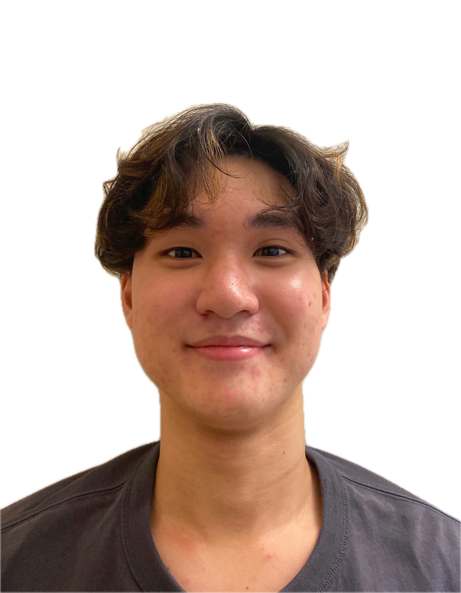
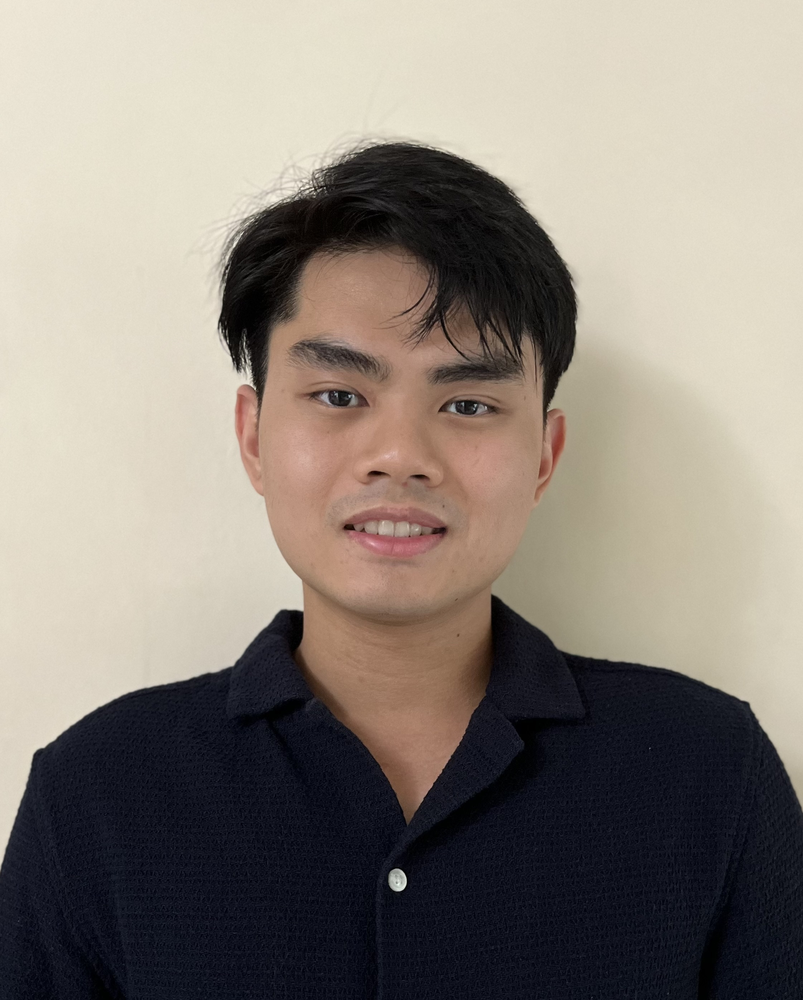

# About Us

We are a team based in the [School of Computing, National University of Singapore](http://www.comp.nus.edu.sg).

You can reach us at the email `seer[at]comp.nus.edu.sg`

## Project team

### Rayner Goh

[[github](https://github.com/raynergoh)]
[[portfolio](team/raynergoh.md)]

* Role: Project Advisor

### Lucius Yeo

[[github](http://github.com/luciusyeo)]
[[portfolio](team/luciusyeo.md)]

* Role: Team Lead
* Responsibilities: UI

### Jovan Teo

[[github](http://github.com/JovanTeo1103)] [[portfolio](team/jovanTeo.md)]

* Role: Developer
* Responsibilities: Data

### Kim Soomin

[[github](http://github.com/soomin-k)]
[[portfolio](team/soomink.md)]

* Role: Developer
* Responsibilities: Dev Ops + Threading

### Ron Koh

[[github](http://github.com/rk2k3)]
[[portfolio](team/ronkoh.md)]

* Role: Developer
* Responsibilities: UI
